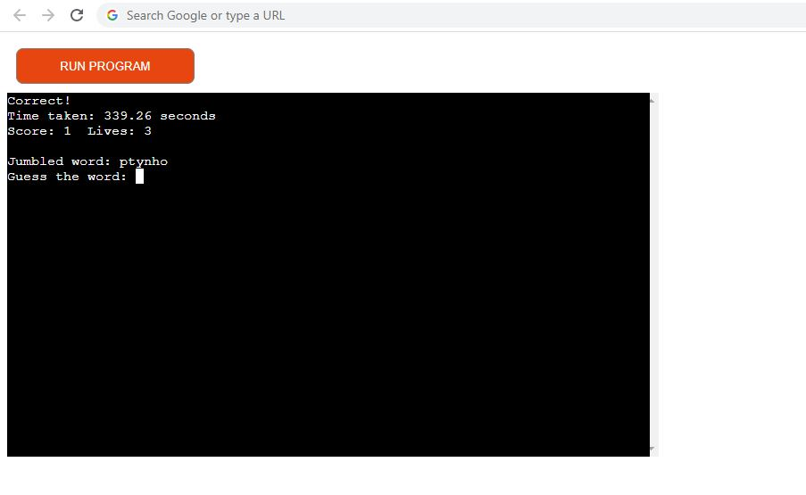
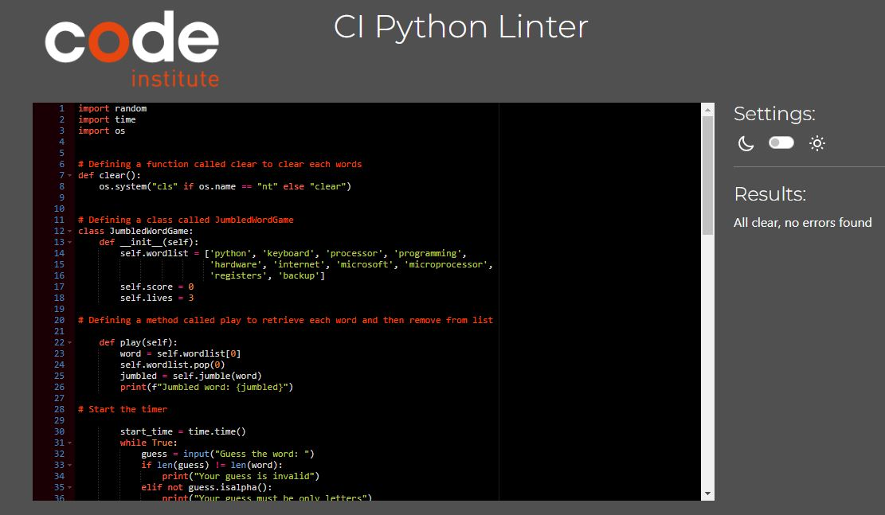

# **Word Jumbler**


[Click here to view the live project](https://word-jumbler.herokuapp.com)

The project is a Jumbled Word Game, which is a fun and educational word game that challenges players to unscramble jumbled words.

Players are presented with a jumbled word and must guess the original word. The program keeps track of the player's score and lives, and the game ends when the player runs out of lives or chooses to quit. The game also provides instructions and an option to play again after each round.


## **How to Play**


The game will begin and present you with a jumbled word to unscramble. Type in your guess for the original word, and the program will let you know if you are correct or incorrect.

You have three lives, so if you guess incorrectly, you will lose a life. If you lose all three lives, the game ends. Your score increases by one for each correct guess, and the program will keep track of your score and lives as you play.The game also displays a time taken to complete each questions.


After each round, you will have the option to play again or quit. If you choose to play again, the game will start over with a new jumbled word and reset your score and lives.

## **Features**


### **Existing Features**


- Instructions to the player

    - The game starts by displaying the instructions to the player.

    

- The jumbled word is displayed, and the player enters their guess. If the answer is correct, the player's score increases to 1, and their remaining lives stay at 3. The time taken for each guess is also displayed.

    

    

- Again a jumbled word is displayed, and the player enters their guess. If the answer is not correct, the player's score stays at 1, and their remaining lives decrease to 2. 

    

    

- When the player has run out of lives, the game ends. Otherwise, the player completes all the questions until the game is over.

- The player is asked if they want to play again. If they choose not to, the final score is displayed. 

    

    

- If they choose to play again, a new game starts with a score of 0 and three lives.

    


### **Future Features**


- Add a high score system: Keep track of the highest scores achieved in the game and display them at the end of each game.

- Add difficulty levels: Make the game more challenging by adding difficulty levels. For example, in the easy level, the words are shorter and have fewer jumbled letters, while in the hard level, the words are longer and have more jumbled letters.


## **Tools & Technologies Used**


- [Python](https://www.python.org) used as the back-end programming language.

- [GitHub](https://github.com) used for secure online code storage.

- [Gitpod](https://gitpod.io) used as a cloud-based IDE for development.

- [Heroku](https://www.heroku.com) used for hosting the deployed back-end site.


### **Classes & Functions**


The program uses classes as a blueprint for the project's objects (OOP). This allows for the object to be reusable.

```python
class JumbledWordGame:
    """ Defining a class called JumbledWordGame """
    def __init__(self):
        self.wordlist = [...]
        self.score = 0
        self.lives = 3
```

The following method is part of the JumbledWordGame class :

- `play(self)`
    - retrieves each word and then removes it from list

The primary functions used on this application are:

- `show_instructions()`
    - To display instructions for the game.
- `play_game()`
    - To play the game.
- `jumble(self, word)`
    - To jumble a word
- `clear()`
    - to clear each words
- `main()`
    - Run all program functions.

## **Testing**


I have manually tested this project by doing the folllowing :

- I confirmed that the game results are always correct.

- Passed the code through a PEP8 Python Validator and confirmed there are no problems.

- Tested in my local terminal and the Code Institute Heroku terminal.

    

    

### **Bugs**

#### **Solved Bugs**

- When I tested, I found that words having repeated letters are not shuffled and displayed as such eg:"css". 

- I also found that absence of user feedback and allowance of empty/invalid data entry causes the function to break. I solved this issue by adding an if else statement.

    


#### **Remaining Bugs**


- No Bugs remaining


### **Validator Testing**


- PEP8
    - No errors were returned from [PEP8](https://pep8ci.herokuapp.com/)

    


### **Lighthouse Testing**


I tested my deployed project using the lighthouse audit tool to check for any major issues.


### **Defensive programming**


Defensive programming was manually tested to validate user inputs.


## **Deployment**


The live deployed application can be found deployed on [Heroku](https://word-jumbler.herokuapp.com).


### **Heroku Deployment**


This project uses [Heroku](https://www.heroku.com), a platform as a service (PaaS) that enables developers to build, run, and operate applications entirely in the cloud.

Deployment steps are as follows, after account setup:

- Select **New** in the top-right corner of your Heroku Dashboard, and select **Create new app** from the dropdown menu.
- Your app name must be unique, and then choose a region closest to you (EU or USA), and finally, select **Create App**.
- From the new app **Settings**, click **Reveal Config Vars**, and set the value of KEY to `PORT`, and the value to `8000` then select *add*.
- Further down, to support dependencies, select **Add Buildpack**.
- The order of the buildpacks is important, select `Python` first, then `Node.js` second. (if they are not in this order, you can drag them to rearrange them)

Heroku needs two additional files in order to deploy properly.
- requirements.txt
- Procfile

You can install this project's **requirements** (where applicable) using:
- `pip3 install -r requirements.txt`

If you have your own packages that have been installed, then the requirements file needs updated using:
- `pip3 freeze --local > requirements.txt`

The **Procfile** can be created with the following command:
- `echo web: node index.js > Procfile`

For Heroku deployment, follow these steps to connect your own GitHub repository to the newly created app:

Either:
- Select **Automatic Deployment** from the Heroku app.

Or:
- In the Terminal/CLI, connect to Heroku using this command: `heroku login -i`
- Set the remote for Heroku: `heroku git:remote -a app_name` (replace *app_name* with your app name)
- After performing the standard Git `add`, `commit`, and `push` to GitHub, you can now type:
	- `git push heroku main`

The frontend terminal should now be connected and deployed to Heroku!


### **Local Deployment**


This project can be cloned or forked in order to make a local copy on your own system.

For either method, you will need to install any applicable packages found within the *requirements.txt* file.
- `pip3 install -r requirements.txt`.


#### **Cloning**


You can clone the repository by following these steps:

1. Go to the [GitHub repository](https://github.com/Amrutha2103/Word-Jumbler) 
2. Locate the Code button above the list of files and click it 
3. Select if you prefer to clone using HTTPS, SSH, or GitHub CLI and click the copy button to copy the URL to your clipboard
4. Open Git Bash or Terminal
5. Change the current working directory to the one where you want the cloned directory
6. In your IDE Terminal, type the following command to clone my repository:
	- `git clone https://github.com/Amrutha2103/Word-Jumbler.git`
7. Press Enter to create your local clone.

Alternatively, if using Gitpod, you can click below to create your own workspace using this repository.

[](https://gitpod.io/#https://github.com/Amrutha2103/Word-Jumbler)

Please note that in order to directly open the project in Gitpod, you need to have the browser extension installed.
A tutorial on how to do that can be found [here](https://www.gitpod.io/docs/configure/user-settings/browser-extension).


#### **Forking**


By forking the GitHub Repository, we make a copy of the original repository on our GitHub account to view and/or make changes without affecting the original owner's repository.
You can fork this repository by using the following steps:

1. Log in to GitHub and locate the [GitHub Repository](https://github.com/Amrutha2103/Word-Jumbler)
2. At the top of the Repository (not top of page) just above the "Settings" Button on the menu, locate the "Fork" Button.
3. Once clicked, you should now have a copy of the original repository in your own GitHub account!


## **Credits**


- Code Institute for the deployment terminal.

- Google for the details of the wordjumbler game.


### **Acknowledgements**


- I would like to thank my Code Institute mentor, [Tim Nelson](https://github.com/TravelTimN) for their support throughout the development of this project.

- I would like to thank the [Code Institute Slack community](https://code-institute-room.slack.com) for the moral support; it kept me going during periods of self doubt and imposter syndrome.

- I would like to thank my partner (Ananthan), for believing in me, and allowing me to make this transition into software development.