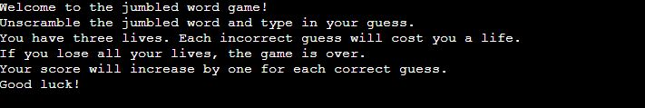
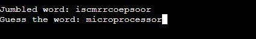
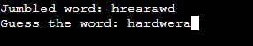
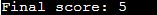

# **Word Jumbler**

[Click here to view the live project](https://word-jumbler.herokuapp.com)

The project is a Jumbled Word Game, which is a fun and educational word game that challenges players to unscramble jumbled words.

Players are presented with a jumbled word and must guess the original word. The program keeps track of the player's score and lives, and the game ends when the player runs out of lives or chooses to quit. The game also provides instructions and a option to play again after each round.

## **How to Play**

The game will begin and present you with a jumbled word to unscramble. Type in your guess for the original word, and the program will let you know if you are correct or incorrect.

You have three lives, so if you guess incorrectly, you will lose a life. If you lose all three lives, the game ends. Your score increases by one for each correct guess, and the program will keep track of your score and lives as you play.

After each round, you will have the option to play again or quit. If you choose to play again, the game will start over with a new jumbled word and reset your score and lives.

## **Features**

### **Existing Features**

- Instructions to the player

    - The game starts by displaying the instructions to the player.

    

    
- The jumbled word is displayed, and the player enters their guess. If the answer is correct, the player's score increases to 1, and their remaining lives stay at 3.

 

- Again a jumbled word is displayed, and the player enters their guess. If the answer is not correct, the player's score stays at 1, and their remaining lives decrease to 2. 

- When the player has run out of lives, the game ends, and the final score is displayed.

- The player is asked if they want to play again. If they choose not to, the game ends. If they choose to play again, a new game starts with a score of 0 and three lives.

### **Future Features**

